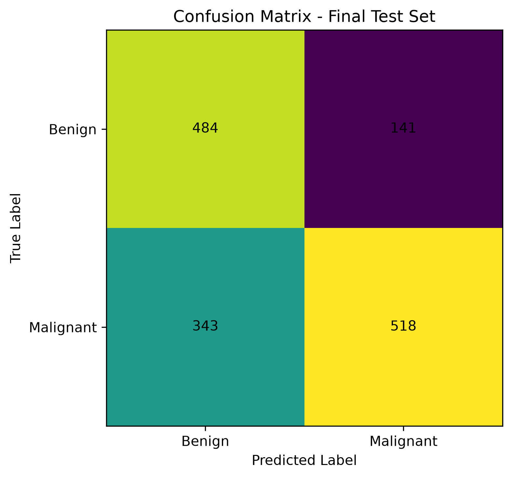
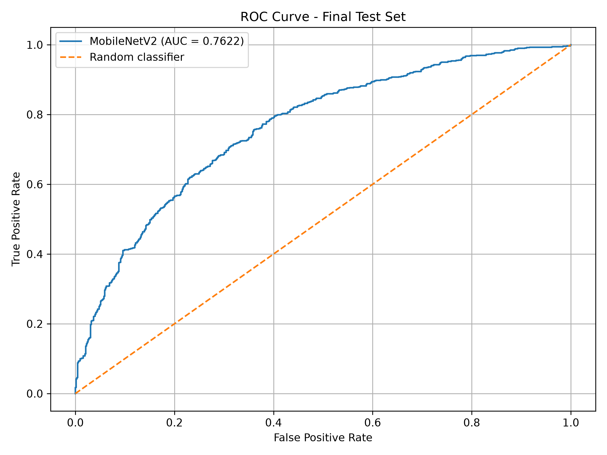
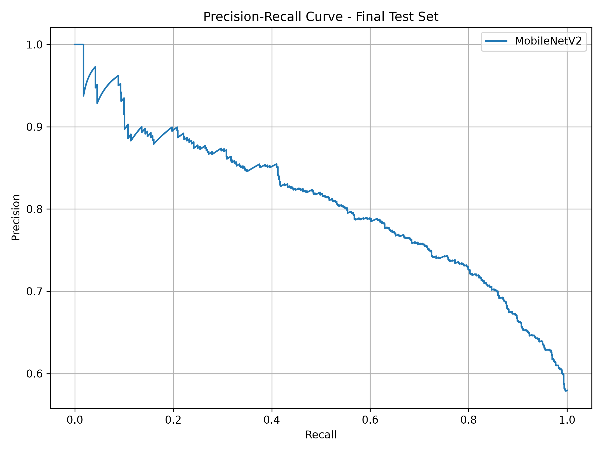
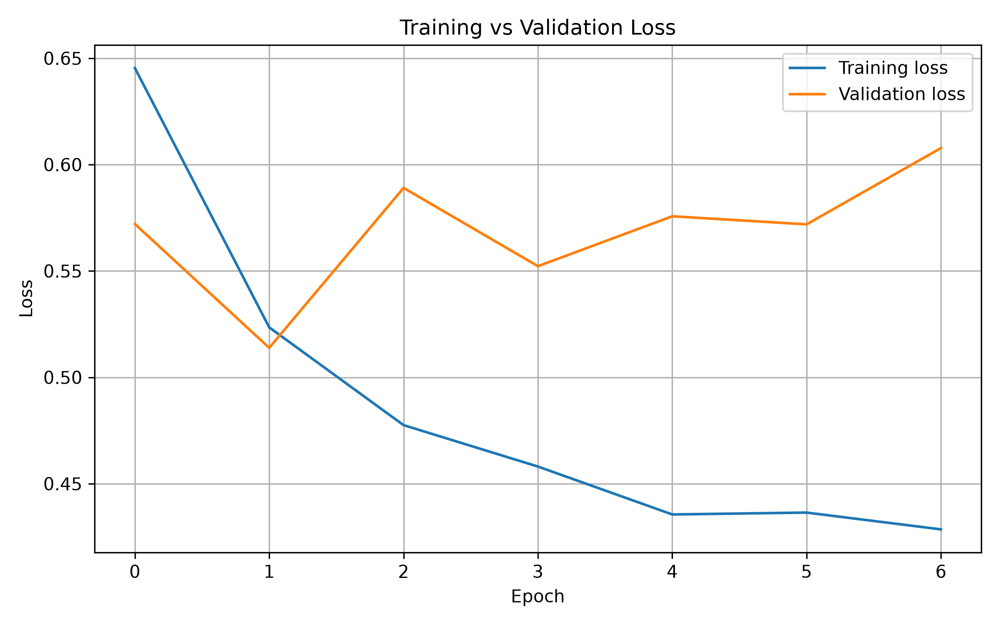
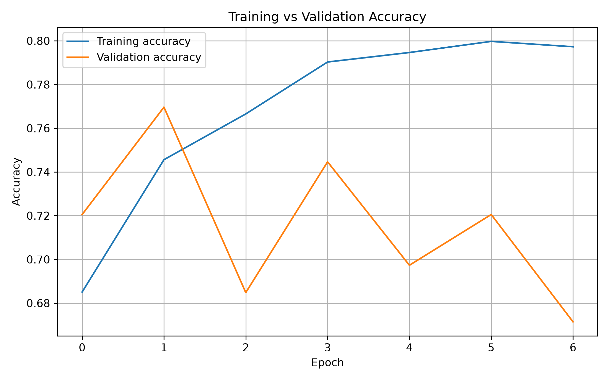
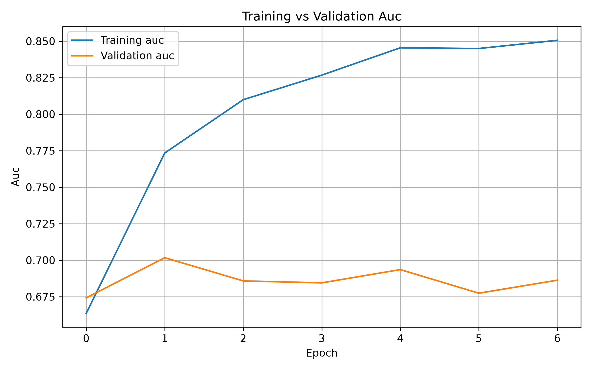
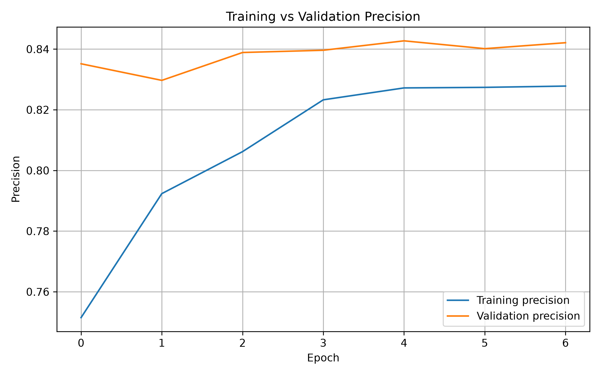
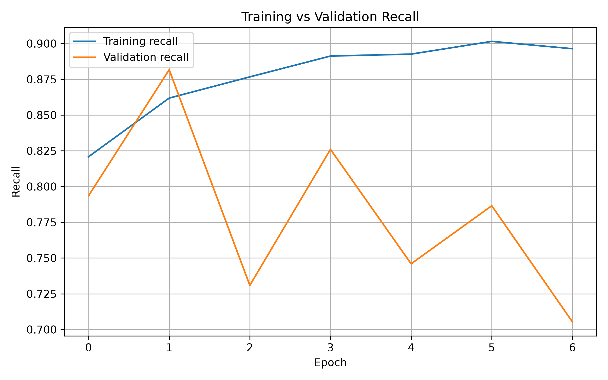
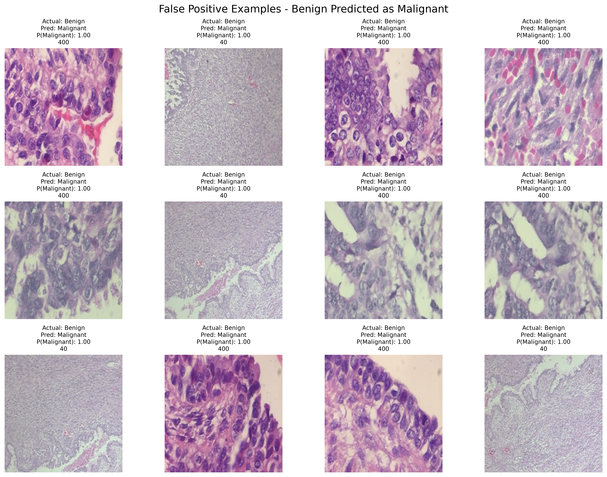
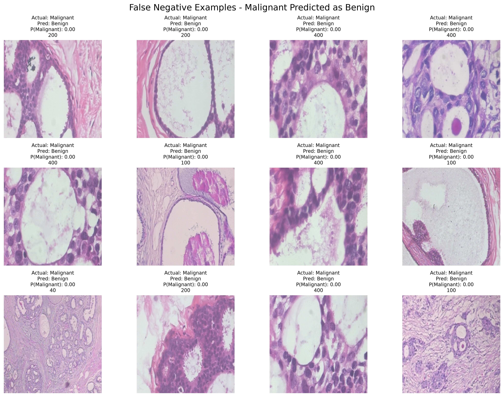

# BreakHis Breast Cancer Classification

## 1. Description

This project classifies breast histopathology images as **benign** or **malignant** using the BreakHis dataset. It uses transfer learning with a MobileNetV2 backbone (pretrained on ImageNet), with a strong focus on proper evaluation: leakage-safe data splitting and close attention to false negatives, since missing a malignant case matters most in a medical context.

---

## 2. Installation

```bash
git clone https://github.com/<your-username>/CV_Histopath_Cancer_Diagnosis.git
cd CV_Histopath_Cancer_Diagnosis

python3 -m venv venv
source venv/bin/activate   # Windows: venv\Scripts\activate

pip install -r requirements.txt
```

Download the [BreakHis dataset](https://web.inf.ufpr.br/vri/databases/breast-cancer-histopathological-database-breakhis/) and place it under `data/raw/BreakHis/` (the raw dataset is git-ignored).

---

## 3. Usage

```bash
python src/data_analysis.py       # explore the dataset
python src/train_val_test.py      # create the leakage-safe split
python src/train_model.py         # train the frozen MobileNetV2 baseline
python src/finetune_model.py      # fine-tune the top layers
python src/class_weight_model.py  # class-weighted fine-tuning
python src/test_evaluation.py     # final evaluation on the test set
python src/error_analysis.py      # inspect misclassifications
```

> ⚠️ The test set is evaluated only after model selection, and never used for further tuning.

---


## 4. Visuals

### Final test evaluation

| Confusion matrix | ROC curve | Precision-recall curve |
|---|---|---|
|  |  |  |

### Training curves

| Loss | Accuracy | AUC |
|---|---|---|
|  |  |  |

| Precision | Recall |
|---|---|
|  |  |

### Error analysis

| False positives (benign → malignant) | False negatives (malignant → benign) |
|---|---|
|  |  |


---

## Important notes

* **Class imbalance** — the dataset is not perfectly balanced between benign and malignant cases; the strongest experiment uses balanced class weights during training to correct for this.
* **Group-level splitting** — images from the same case/slide are kept together in one split only, to avoid data leakage between train, validation, and test.
* **Validation vs. test gap** — validation AUC (0.8208) is noticeably higher than final test AUC (0.7622), a reminder that validation performance doesn't always fully transfer.
* **Accuracy is not enough** — for a medical task, recall on the malignant class matters more than overall accuracy, since a false negative is more costly than a false positive.
* **Combined experiment** — the best result combines class weighting and fine-tuning depth together, so their individual effects can't be separated from this experiment alone.
* **No test-set tuning** — the test set is used exactly once, after model selection, and is never used to adjust hyperparameters or thresholds.

---

## 5. Contributor

* [Hussein Abuammar](https://www.linkedin.com/in/hussein-abuammar/)()

---

## 6. Timeline

* **Day 1** — Dataset exploration.
* **Day 2** — Leakage-safe split, preprocessing.
* **Day 3** — Frozen baseline training, fine-tuning experiments, final model selection.
* **Day 4** — Evaluation, error analysis.
* **Day 5** — Documentation.

---

## 7. Personal situation

This project was completed as a 5-day consolidation challenge, worked on solo. The original challenge brief was adapted to a different domain, which meant designing the dataset split, preprocessing pipeline, and evaluation methodology from scratch within a tight timeframe, rather than following a fixed template.

This challenge was great experience for me in working with computer vision and medical images. My main constraint, however, was class imbalance, which affected the final malignant recall (0.6016).
